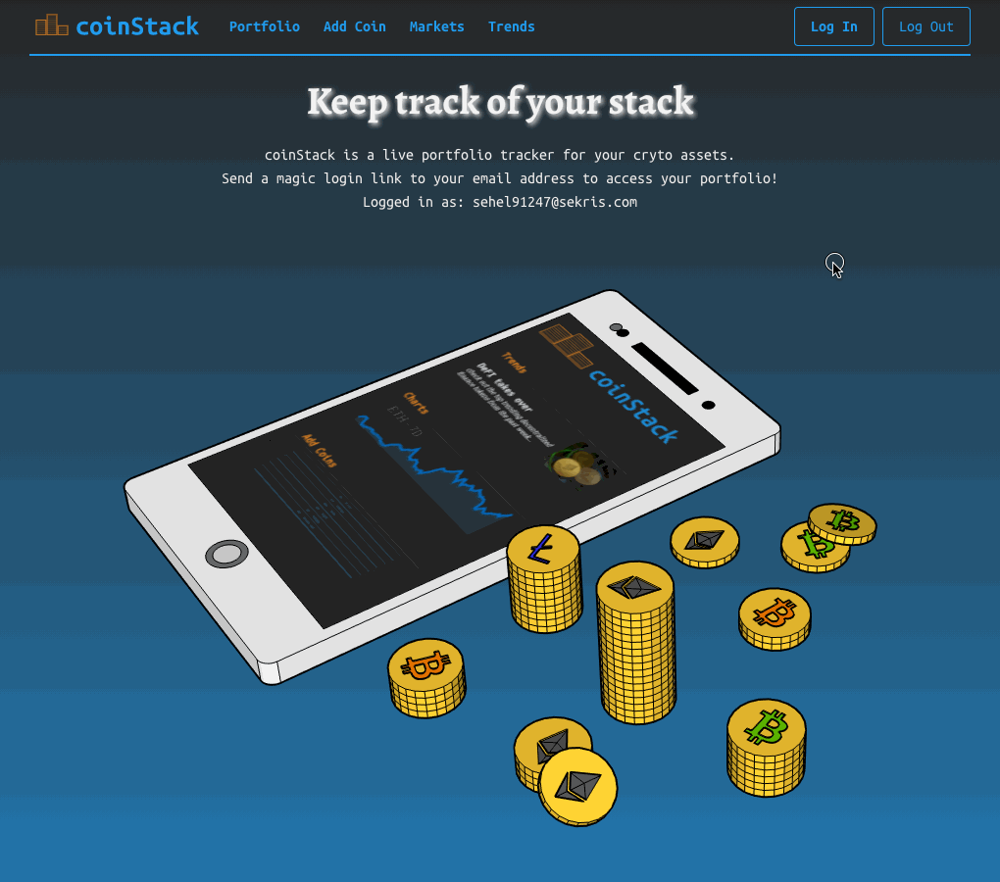

# coinStack

**A live cryptocurrency portfolio tracker.**

coinStack is for anyone that wants a convenient way to check their crypto portfolio on any device.

Keep track of all your investments. Get a live look at the value of your stack and of any prices you want to follow. Stay up on trends and market movements as well.

No account sign-up needed. Simply get a magic login link sent to your email address.

### Preview



### Inspired by the popular mobile-only app "Blockfolio"

[Blockfolio.com](https://blockfolio.com) <br />
[Play Store Details](https://play.google.com/store/apps/details?id=com.blockfolio.blockfolio&hl=en_US) <br />

### Architecture

coinStack was created using React and Bulma. It's responsive so it looks good on any device. The data is provided by CoinGecko.

Generated with Create-React-App. To run locally:

- clone
- npm/yarn install
- npm/yarn start
- create a firebase.js file in src folder according to the firebase docs

```text
  -src
    -assets        // images
    -components    // subfolders for each website tab
```
